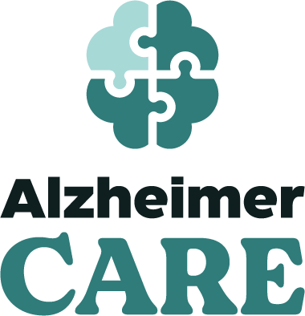

  

<h1 align="center">Alzheimer Care</h1>

  iOS application for patient–caregiver coordination

---

## 🧠 About the App

**Alzheimer Care** is an iOS application designed to support coordination between patients affected by Alzheimer’s disease and their caregivers.

The app provides a shared digital environment where daily care activities can be organized, health-related notes can be recorded, and communication between patients and caregivers can take place in a structured and accessible way.

---

## ✨ Key Features

- 🗂 Task and medication management  
- 📔 Personal diary (text, images, audio, and video)  
- 💬 In-app chat between patient and caregiver  
- 📞 Contact and call management  
- 🌗 Light and dark mode support  

---

## 🛠 Technology Stack

- Swift  
- SwiftUI  
- iOS SDK  
- Supabase (backend services and database management)

---

## 👥 Team

- Antonio Ferone  
- Mouchtakiri Azzeddine  
- Wafae El Ahmadi  
- Lorenzo Ascione  
- Giuseppe Curcio  
- Sanauallah Aman  
- Tauheed Khan  

---

## 📂 Project Notes

This repository contains the source code of the iOS application.

User-specific files, build artifacts, and sensitive configuration data are excluded from version control.

---

## 📅 Academic Context

Developed as in the Foundation academic project.  
Year: 2025–2026
